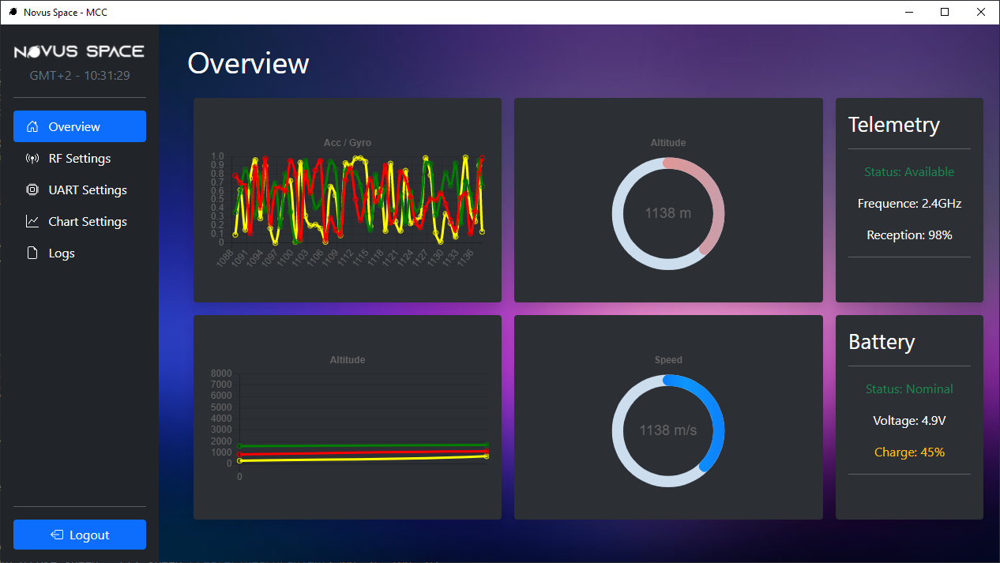

# Novus - MCC

Thanks to all of people who helped me in this project !

## What is it ?

The Novus - MCC is the brand new Mission Control Center from Novus Space, created to help Rockets amateurs to monitor their launches. 
The solution is built to update graphs, gauges and other cool stuffs by listening a socket. 
This is why I give you a python script that can read serial port from an Arduino for example and send it through a socket, directly connected to the software.

## Usage

Here's somme cool photos of what is look like

  

